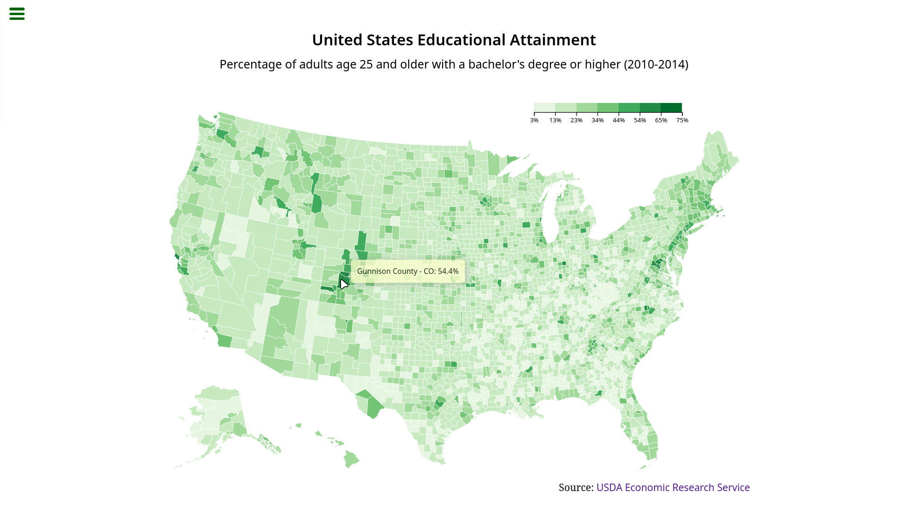

    
  <a href="https://github.com/mateus-sartorio/choropleth-map"><kbd>🔵 GitHub</kbd></a>

# FreeCodeCamp Choropleth Map Challenge

 

  

 

You can find a working demo of this project [here](https://codepen.io/mateussartorio/pen/dyxPQdK).

This project involves creating a choropleth map using D3.js, visualizing U.S. educational attainment data from the provided JSON file. The map displays the percentage of adults with a bachelor's degree or higher across different counties, with color gradients representing various education levels. Interactive tooltips provide detailed information about each county upon hovering. The challenge focuses on data visualization techniques, using geographic data with TopoJSON, and effectively presenting information through color scales and responsive design.

This project is the fourth challenge for the [Data Visualization certification](https://www.freecodecamp.org/learn/data-visualization) from freeCodeCamp and can be found [here](https://www.freecodecamp.org/learn/data-visualization/data-visualization-projects/visualize-data-with-a-choropleth-map).