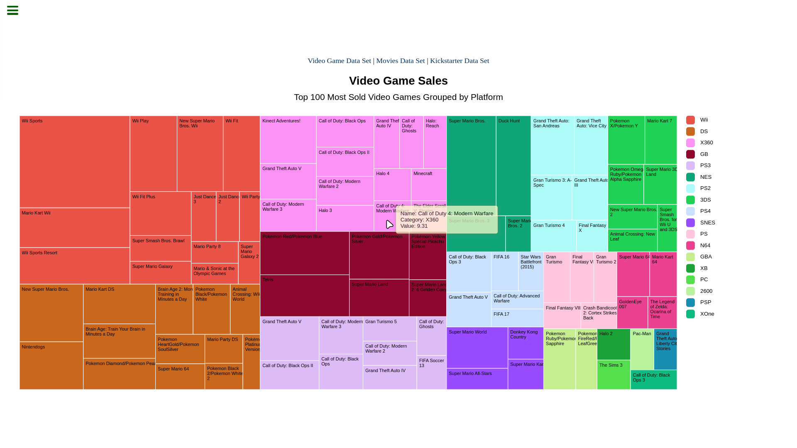
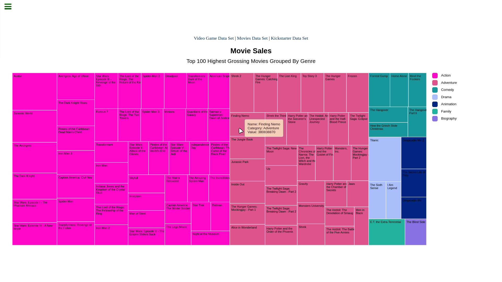
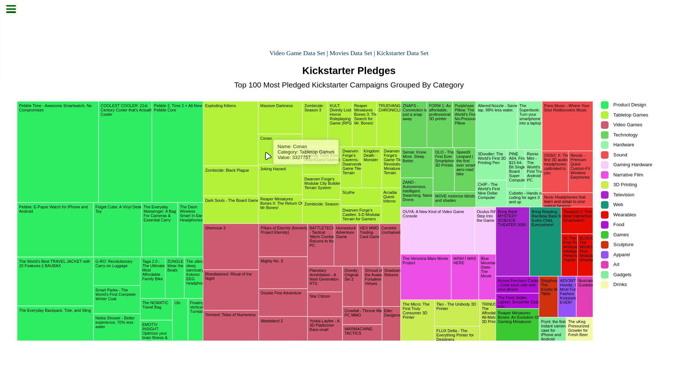

    
  <a href="https://github.com/mateus-sartorio/treemap-diagram"><kbd>🔵 GitHub</kbd></a>

# FreeCodeCamp Treemap Diagram Challenge

 

  

  
  

 

You can find a working demo of this project [here](https://codepen.io/mateussartorio/pen/ZEgbYwx).

This project involves creating a treemap diagram using D3.js to visualize hierarchical data from the provided JSON file. The treemap displays various categories and their corresponding values, representing the size and distribution of each segment in a compact and informative manner. Different colors are assigned to each category, making it easy to distinguish between them at a glance. Interactive tooltips provide additional details about each segment, including names and values, upon hovering. The challenge emphasizes effective data visualization techniques, hierarchical data representation, and the use of responsive design to clearly present complex datasets in a visually appealing format.

This project is the fifth challenge for the [Data Visualization certification](https://www.freecodecamp.org/learn/data-visualization) from freeCodeCamp and can be found [here](https://www.freecodecamp.org/learn/data-visualization/data-visualization-projects/visualize-data-with-a-treemap-diagram).
